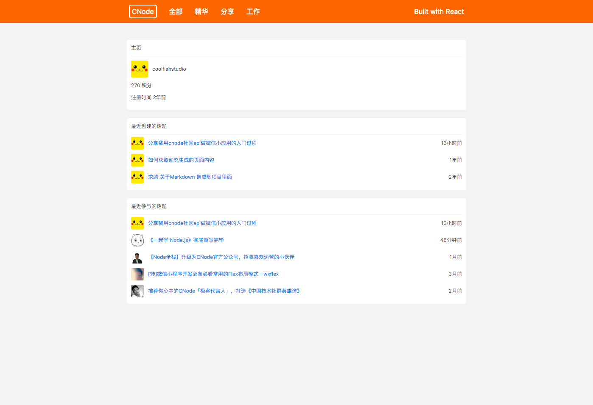

# cnode-react
第一个react练手项目，react框架写的cnode社区，数据来源于[cnode api](http://cnodejs.org/api)，感谢cnode提供的api。

[线上预览地址](http://chuuup.applinzi.com/cnode)

## npm
- redux
- react-redux
- react-route
- redux-thunk
- redux-logger
- antd

## 语法
- es6

## 运行
    npm install
    npm start

## 生产
    npm run build

## Screen Shot

## todo
- ~~浏览器显示title（切换页面时，title应该改变~~
- ~~添加user页面~~
- react-router 后退会重新加载
- ~~添加webpack生产配置 npm run build~~
- ~~添加热加载HMR~~
- ~~压缩bundle.js文件~~

## 坑
- @user 由于无法改变href，所以点击会跳转到错误界面